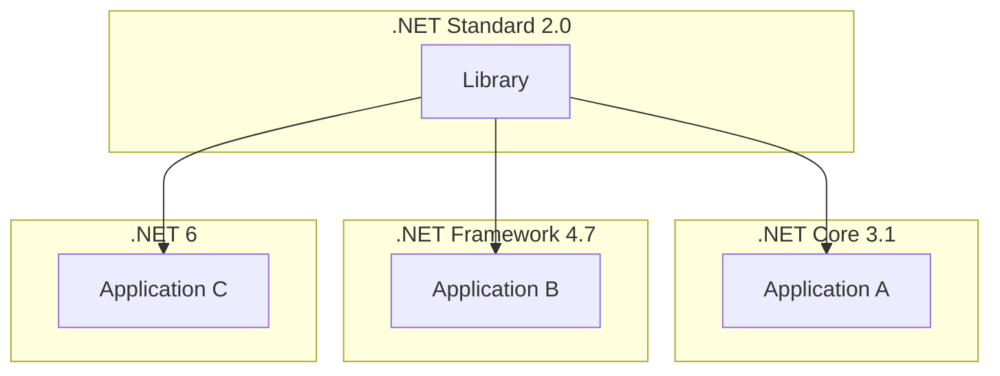

# Description
A system upgrade

## Scenario
A system consists of three different applications along with a shared Library system all of which are kept in separate repositories.

To simplify the codebase, a library system created with shared code that is used in all three 
applications to prevent code duplication.

.NET 8 was recently released and management tasks you to upgrade all systems to .NET 8, how do you proceed?

The system can be simplistically represented as below:

### Additional information
 - The applications are hosted in the Cloud environment
 - Runs in a serverless/containerised environment
 
 ## Internal guiding questions
 - Compatability
 - Dependencies
 - Infrastructure support
 - Risks
 - Testing?
 
